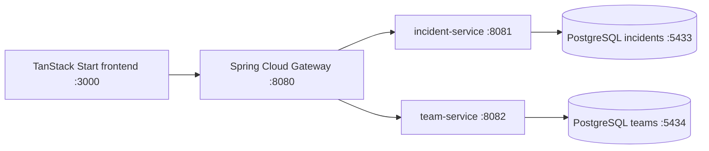

# OpsBoard - DevOps Project Report

## Project Goal

OpsBoard is a microservice web application used to track DevOps incidents and the teams responsible for them. It demonstrates a complete DevOps workflow with layered software architecture, tests, coverage, quality checks, PostgreSQL, Docker Compose, and CI.

## Architecture

## Layered Backend Design

Each business service is split into:

- Data layer: JPA entities and repositories
- Service layer: business rules and validations
- Controller layer: REST API and validation errors

## Microservices

- `incident-service`: incident creation, status updates, dashboard statistics
- `team-service`: team registry, service ownership, on-call engineer updates
- `gateway`: public API entry point and CORS configuration

## DevOps Tooling

- GitHub Actions pipeline in `.github/workflows/ci.yml`
- Docker Compose full stack in `docker-compose.yml`
- JaCoCo coverage reports in `backend/*/target/site/jacoco`
- Checkstyle quality reports in `backend/*/target/checkstyle-result.xml`
- Frontend tests and build checks in `frontend`

## Test Reports

After running `mvn -f backend/pom.xml verify`, attach:

- Surefire test reports from `backend/*/target/surefire-reports`
- JaCoCo HTML reports from `backend/*/target/site/jacoco/index.html`
- Checkstyle XML reports from `backend/*/target/checkstyle-result.xml`

After running frontend checks, attach:

- Vitest output
- TanStack Start build output

## Google Labs

Add screenshots of the completed Google labs in this section before Moodle submission.

